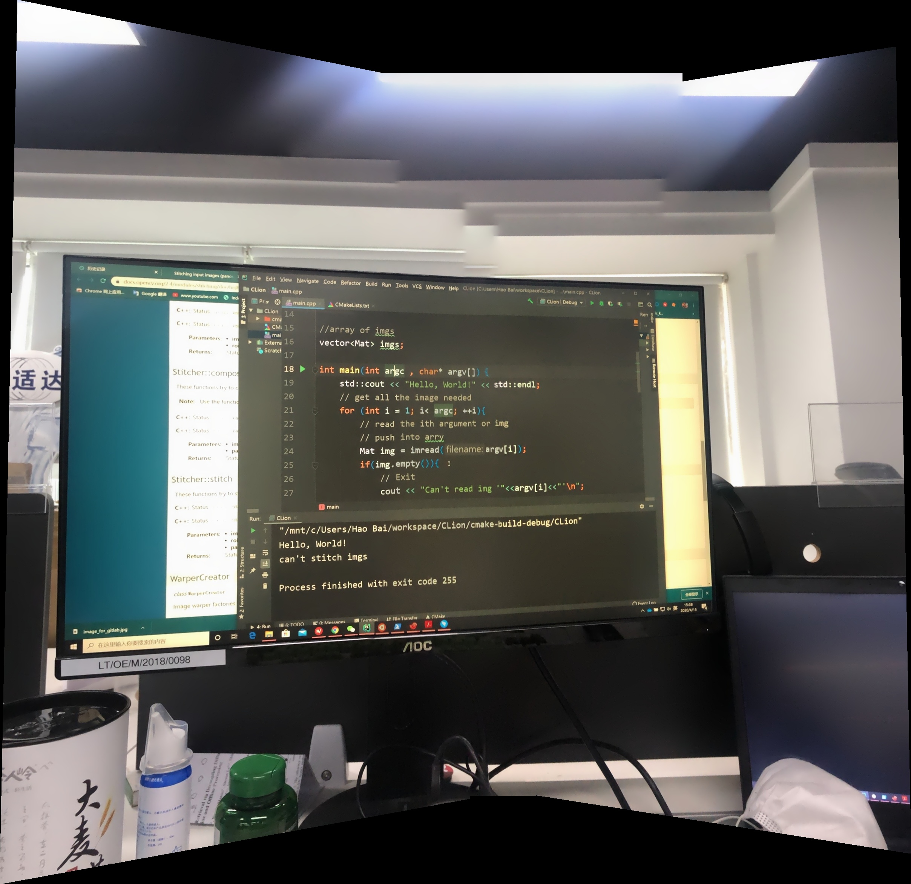
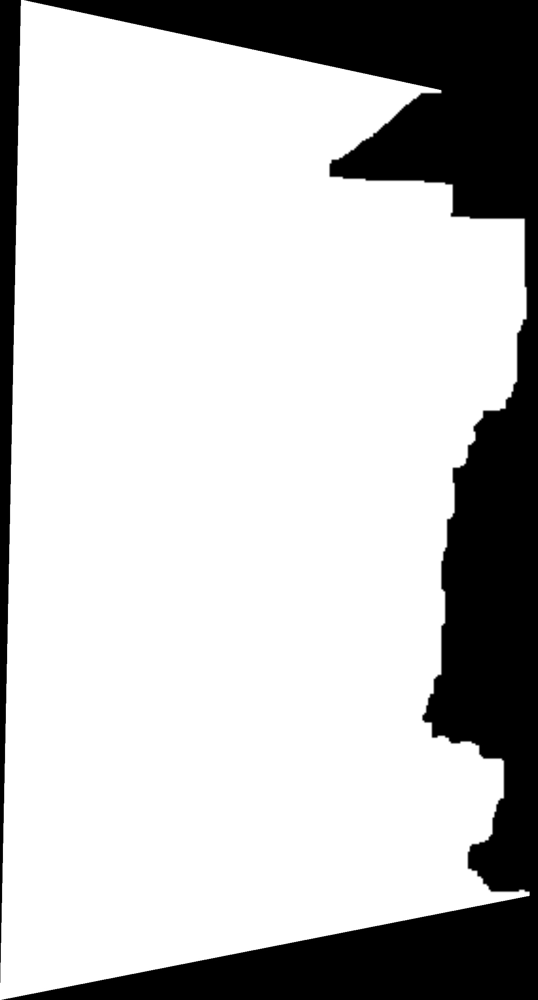

# lenZ Panorama Mobile 

---
### 输入值
``` C
store_each:整个全景拼接需要的图，参数，返回的参数
            需要提前把这次新加的图片先push到all_param.full_imgs最后一个
i: 本张图的index，比如第一张图就传0，第二张就传1
```
---
### 返回值


``` C
store_each: 整个全景拼接需要的图，参数，返回的参数
store_each.status : 
    0: 正常
    1：异常，需要把all_params回滚到传入的时候
store_each.result_stitched_img: 返回的拼接图片
```


---
# Aim
This project aims to optimize our stitching tools and let our stitching job looks more vivid. And can be place on mobile. 
 
---
1. use modern image body seam search method to get more acc seam between two images
2. use sequence matching to save time rather than get images sequence based on match all and get best pairs
3. use light balance to balance two images light, the stitched body will see vivid

---
#### test result
1. horizontal 9 images Cylindrical Warper -- Nice
2. horizontal and vertical total 4 images Cylindrical or Plane Warper -- Nice
### result images 

### seam (mask) result


